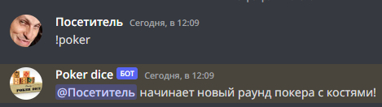
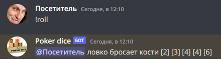
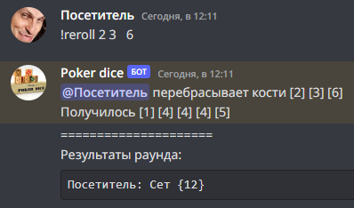
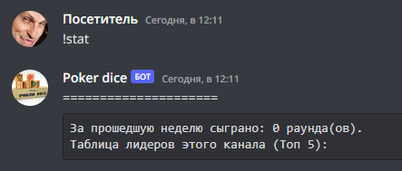

# Poker dice bot for discord

Представьте ситуацию: вы один или еще с кем-нибудь ждете компанию для похода в рейд в мморпг/катки в доту/матча в кс го/
и так далее, вам уже скучно, актуальные мемы закончились, а баяны кидать еще стыдно... на помощь приходит простой в освоении 
и быстрый покер на костях. Ксли бот на канале, то простой командой !poker вы запускаете раунд и понесло...

## Список команд

!poker - служит для запуска раунда
!roll - бросок костей (5d6)
!reroll - переброс неудачных костей
!pass - пропуск переброса, если комбинация не требует изменений
!finish - досрочное завершение раунда (доступно только начавшему раунд)
!stat - статистика раундов по текстовому каналу
!help - описание работы бота, команды

## Примеры работы

Начало раунда:

Бросок костей:

Переброс неподходящих под комбинацию костей:

Вызов статистики по каналу:


## Как запустить

Этот скрипт скопирует проект с гита, сбилдит его на вашем сервере, затем запустит с указаным токеном:

```bash
$ git clone https://github.com/ath31st/poker_dice_bot
$ cd poker_dice_bot
$ docker build . -t poker
$ docker run -e TOKEN='YOUR TOKEN' -t poker
```
Далее, вам остается только добавить бота на свой сервер.